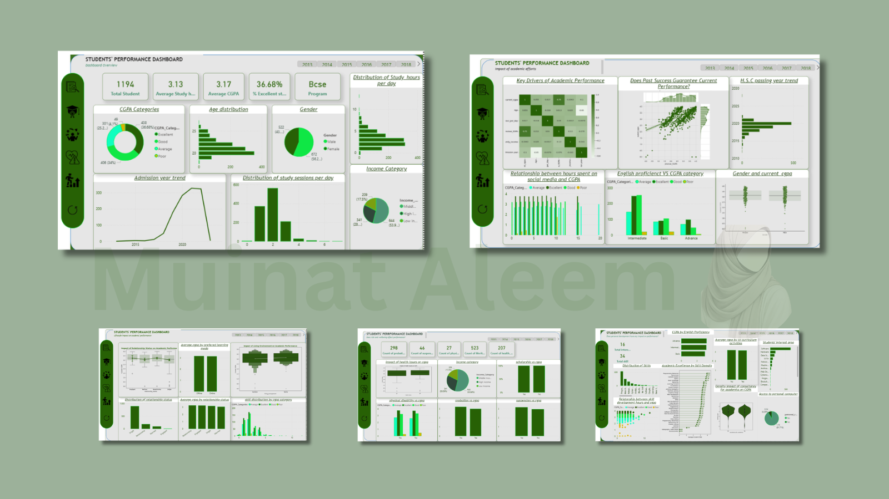
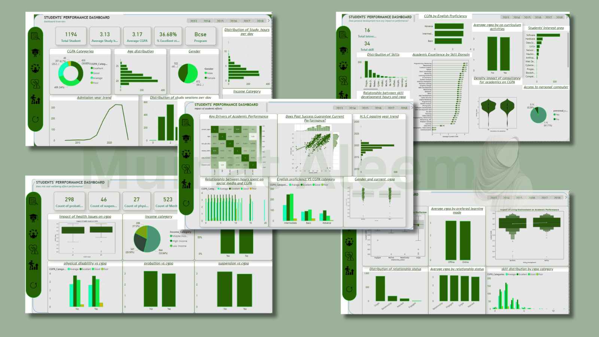

## 📊 Dashboard Preview

# 🎓 Student Performance Analysis
A data-driven analysis of student academic performance using excel, Power BI and Python

🎓 Research Report
Deciphering Student Performance in BSCE

A Data-Driven Study of 1,194 Undergraduates

## 📌 Project Overview
This research was conducted to address a critical question in higher education:

What truly drives academic success in a high-pressure Computer Engineering (BSCE) program?

## 📊 Dataset Description

Using a dataset of 1,194 undergraduate students, this study moves beyond assumptions and identifies the behavioral, environmental, and socio-economic factors that determine whether a student achieves academic excellence or falls into academic risk.

Rather than focusing solely on performance outcomes, this analysis uncovers the underlying drivers of success and failure, enabling actionable, data-driven interventions.

## 🧠 Key Findings; key Drivers of Performance 

**📉 The “4-Hour” Digital Threshold**

A clear behavioral tipping point emerges when analyzing social media usage.

**Finding**

Students with Excellent CGPA (≥ 3.5) consistently limit social media usage to 1–2 hours daily.

**Risk Insight**

Once usage exceeds 4 hours daily, academic performance drops significantly.
Students in the “Poor” category are heavily concentrated in the 5+ hour range.

**Interpretation**

In a demanding program like BSCE, excessive digital consumption disrupts:

Focus
Deep work
Cognitive endurance

👉 Social media is not just a distraction—it is a measurable academic risk factor.

**🏠 The “Family Anchor” vs. “Bachelor” Volatility**

Living conditions play a surprisingly strong role in performance stability.

**Finding**

Students living with family exhibit more stable and consistent CGPA trends.

**Risk Insight**

Students living independently (hostels/rentals):

Show greater performance volatility
Have lower attendance rates
Represent a higher share of the 298 probation cases

**Interpretation**

A structured home environment provides:

Routine
Accountability
Reduced external distractions

👉 Lack of structure leads to discipline breakdown, not necessarily lack of ability.

**🗣️ The “Intermediate” English Ceiling**

Language proficiency reveals a hidden academic bottleneck.

**Finding**

“Advanced” English speakers dominate the Excellent category
“Intermediate” speakers form the largest group but remain stuck in “Average”

**Insight**

Intermediate proficiency enables basic understanding but limits:

Technical comprehension
Documentation mastery
Concept articulation

👉 This creates a performance ceiling, not a capability issue.

**📊 Study Effort vs. Study Effectiveness**

**Finding**

Average study time (~3.13 hours) does not consistently produce high CGPA.

**Interpretation**

Students are putting in time
But lack effective study strategies

👉 Effort without structure = diminishing returns

3. Institutional Equalizers (What’s Working)
💰 The Scholarship Success Effect

**Finding**

Despite 53.9% of students coming from low-income backgrounds, their performance is comparable to higher-income peers.

**Key Driver**

523 students benefit from merit-based scholarships

**Interpretation**

Scholarships:

Reduce financial stress
Improve academic focus
Enable equal participation

👉 Financial aid is not a support tool, it is a performance equalizer.

**🧠 The “Help-Seeking Paradox”**

**Finding**

High-performing students actively engage in teacher consultancy, while struggling students avoid it.

**Problem**

Students on probation are least likely to seek help
Creates a cycle of silent academic decline

**Interpretation**

The issue is not availability of support—but access behavior.

👉 Those who need help most are the least likely to ask for it.

 **Risk Indicators** 
 
🚨 Academic Risk Factors
Probation: 298 students
Health Issues: 207 students
Suspension Cases: Present but critical

**Insight**

These factors are strongly associated with:

Lower CGPA
Performance instability
📈 Performance Consistency

**Finding**

A strong positive relationship exists between:

Previous SGPA and Current CGPA (~0.75 correlation)
Interpretation

Academic performance is predictable early

👉 Institutions currently intervene too late

## 🟢 Recommendations ; Strategic Recommendations (What Should Be Done)

✅ 1. Early Warning System Using SGPA

Action:

Flag at-risk students within the first month
Use previous academic records as predictors

👉 Shift from reactive → proactive intervention

✅ 2. Mandatory Academic Consultancy

Action:

Enforce compulsory check-ins for:
Students with <80% attendance
Students below CGPA threshold

👉 Remove dependency on student self-initiation

✅ 3. Digital Discipline Framework

Action:

Introduce structured time management programs
Educate students on “deep work” principles

👉 Address root cause of distraction

✅ 4. Technical English Development Program

Action:

Introduce a Technical Communication module
Focus on:
Documentation
Interpretation
Technical writing

👉 Break the “Intermediate ceiling”

✅ 5. Gap-Year Academic Bootcamp

Action:

Provide pre-semester refresher programs
Focus on:
Mathematics
Logical reasoning

👉 Restore academic momentum

✅ 6. Structured Living Support

Action:

Provide guidance programs for students living independently
Encourage discipline systems (study routines, peer groups)

**Final Conclusion**

This study reveals that academic success in BSCE is not driven by intelligence alone, but by a combination of:

Digital discipline
Structured environment
Language proficiency
Proactive institutional support

Students do not fail because they lack ability—they fail because systems fail to support their behavior early enough.

By:

Strengthening early intervention systems
Encouraging structured habits
Maintaining financial support

👉 Institutions can transform average performers into excellent engineers
